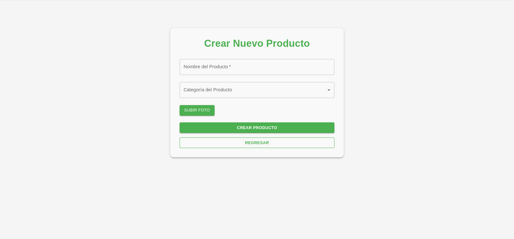
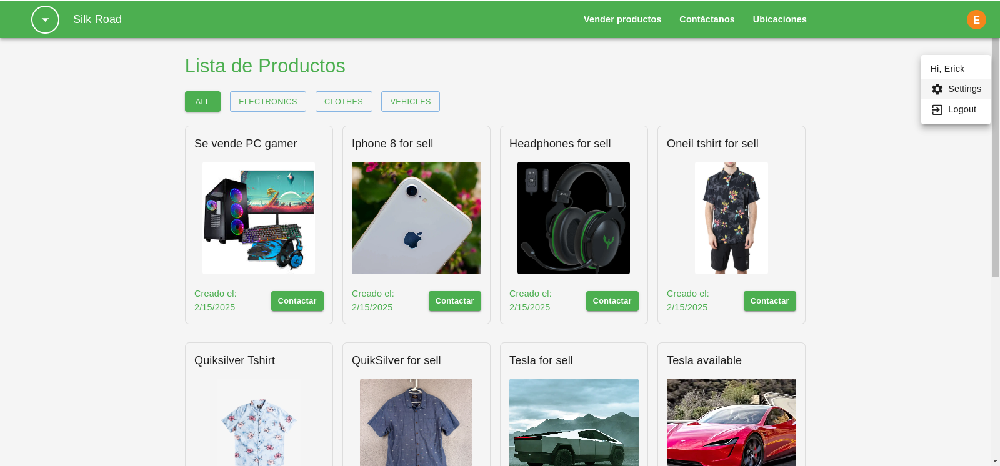

# Market-Place

# still in development

## SETUP NODE ENV 
set NODE_OPTIONS=--openssl-legacy-provider

## START FRONTEND
cd frontend  
npm install  
npm start  

## START APP-CORE
cd backend/storecore
npm i -g @nestjs/cli  
npm install  
nest start --watch (listening mode)  
nest start  

### Screenshots
# Login

# Register

# Create product

 # Home

# Settings

