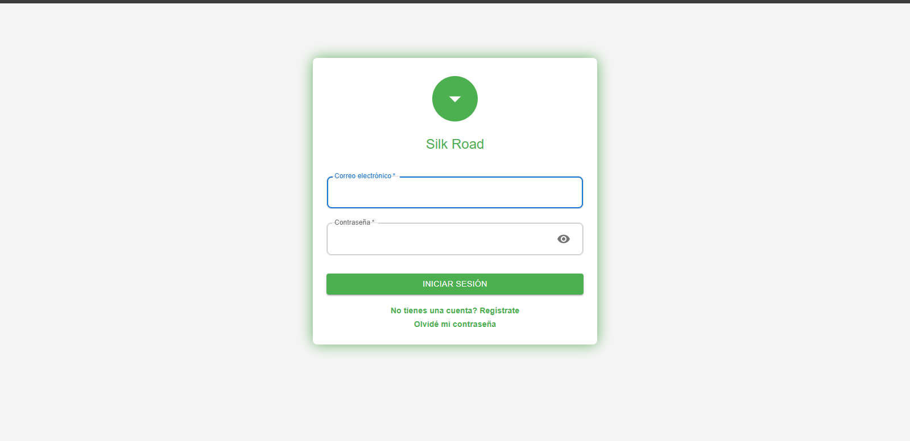
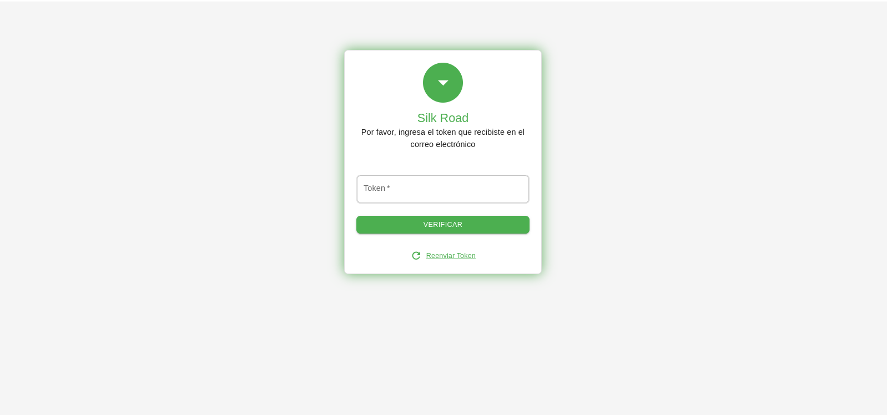
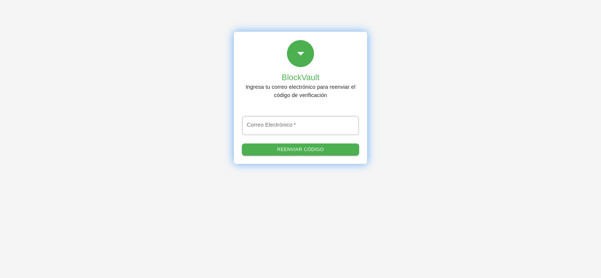
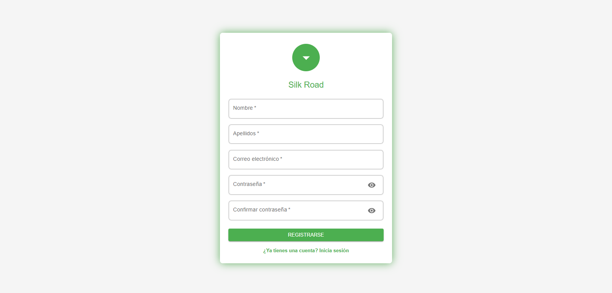
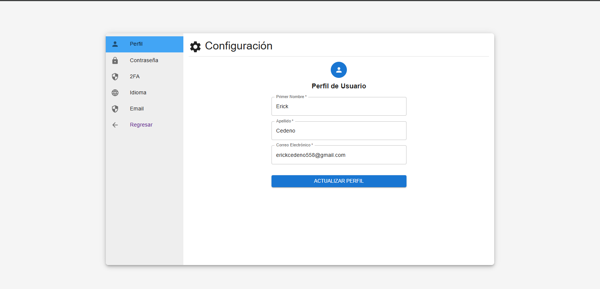

# Market-Place still in development

# 🛠️ Tecnologías Stack


# Setup node env 
```
$ set NODE_OPTIONS=--openssl-legacy-provider
```

# Start frontend
```
$ cd frontend  
$ npm install  
$ npm start
```

# Start storecore
```
$ cd backend/storecore
$ npm i -g @nestjs/cli  
$ npm install  
$ nest start --watch (listening mode)  
$ nest start
```


# Screenshots
# Login


# verify token


# Resend token


# Register


# Settings


# DEMO VIDEO
<img src="frontend/src/assets/screenshots/silk.gif"